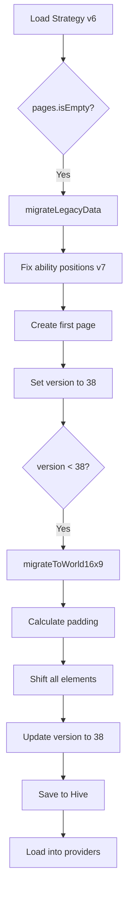

## Overview

Icarus uses a schema versioning system to ensure backward compatibility when loading older strategies. As the app evolves, the data structure changes, and migrations automatically upgrade old strategies to the current format.

## Version Tracking

Every strategy stores a `versionNumber` field that corresponds to the app version when it was last saved.

**Current version:** `Settings.versionNumber = 38`  
**Location:** `lib/const/settings.dart:41`

```dart
static const int versionNumber = 38;
static const String versionName = "3.1.0";
```

When loading a strategy, the app compares the stored `versionNumber` to the current version and applies necessary migrations.

## Migration Entry Point

All migrations are triggered when loading a strategy from Hive or importing a file.

**Location:** `lib/providers/strategy_provider.dart:269-280`

```dart
static Future<void> migrateAllStrategies() async {
  final box = Hive.box<StrategyData>(HiveBoxNames.strategiesBox);
  for (final strat in box.values) {
    final legacyMigrated = await migrateLegacyData(strat);
    final worldMigrated = migrateToWorld16x9(legacyMigrated);
    if (worldMigrated != legacyMigrated) {
      await box.put(worldMigrated.id, worldMigrated);
    } else if (legacyMigrated != strat) {
      await box.put(legacyMigrated.id, legacyMigrated);
    }
  }
}
```

This function can be called during app startup to batch-migrate all strategies in the database.

## Migration Pipeline

Migrations are applied in sequence:

1. **Legacy Data Migration** - Convert flat structure to page-based architecture
2. **World Coordinate Migration** - Adjust coordinates from 1.24:1 to 16:9 aspect ratio

Each migration checks if it needs to run and returns the (possibly modified) strategy.

## Legacy Data Migration

Early versions of Icarus stored all elements at the strategy level. Version 15 introduced multi-page support, requiring migration of old single-page strategies.

**Location:** `lib/providers/strategy_provider.dart:282-332`

```dart
static Future<StrategyData> migrateLegacyData(StrategyData strat) async {
  // Already migrated
  if (strat.pages.isNotEmpty) return strat;
  if (strat.versionNumber > 15) return strat;
  
  final originalVersion = strat.versionNumber;
  log("Migrating legacy strategy to single page");
  
  // Handle ability position fix for version < 7
  final abilityData = [...strat.abilityData];
  if (strat.versionNumber < 7) {
    for (final a in abilityData) {
      if (a.data.abilityData! is SquareAbility) {
        a.position = a.position.translate(0, -7.5);
      }
    }
  }

  final firstPage = StrategyPage(
    id: const Uuid().v4(),
    name: "Page 1",
    drawingData: [...strat.drawingData],
    agentData: [...strat.agentData],
    abilityData: abilityData,
    textData: [...strat.textData],
    imageData: [...strat.imageData],
    utilityData: [...strat.utilityData],
    isAttack: strat.isAttack,
    settings: strat.strategySettings,
    sortIndex: 0,
  );

  final updated = strat.copyWith(
    pages: [firstPage],
    agentData: [],
    abilityData: [],
    drawingData: [],
    utilityData: [],
    textData: [],
    versionNumber: Settings.versionNumber,
    lastEdited: DateTime.now(),
  );

  return migrateToWorld16x9(updated,
      force: originalVersion < Settings.versionNumber);
}
```

### Migration Steps

<Steps>
  <Step title="Check if migration needed">
    Skip if `pages.isNotEmpty` or `versionNumber > 15`
  </Step>
  
  <Step title="Fix legacy ability positions">
    Versions before 7 had incorrect square ability anchors. Translate Y position by -7.5 units.
  </Step>
  
  <Step title="Create first page">
    Move all legacy data fields into a new `StrategyPage` object
  </Step>
  
  <Step title="Clear legacy fields">
    Set old fields to empty arrays to avoid duplication
  </Step>
  
  <Step title="Update version number">
    Set `versionNumber` to current version and update `lastEdited`
  </Step>
  
  <Step title="Apply coordinate migration">
    Chain to `migrateToWorld16x9()` for aspect ratio fix
  </Step>
</Steps>

## World 16:9 Migration

Version 38 introduced a new coordinate system with 16:9 aspect ratio to match modern displays. Older strategies used a 1.24:1 aspect ratio based on Valorant's in-game minimap.

**Location:** `lib/providers/strategy_provider.dart:334-478`

```dart
static StrategyData migrateToWorld16x9(StrategyData strat,
    {bool force = false}) {
  if (!force && strat.versionNumber >= 38) return strat;

  const double normalizedHeight = 1000.0;
  const double mapAspectRatio = 1.24;
  const double worldAspectRatio = 16 / 9;
  const mapWidth = normalizedHeight * mapAspectRatio;
  const worldWidth = normalizedHeight * worldAspectRatio;
  const padding = (worldWidth - mapWidth) / 2;

  Offset shift(Offset offset) => offset.translate(padding, 0);

  // ... shift functions for each element type ...

  final updatedPages = strat.pages
      .map((page) => page.copyWith(
            agentData: shiftAgents(page.agentData),
            abilityData: shiftAbilities(page.abilityData),
            textData: shiftTexts(page.textData),
            imageData: shiftImages(page.imageData),
            utilityData: shiftUtilities(page.utilityData),
            drawingData: shiftDrawings(page.drawingData),
            lineUps: shiftLineUps(page.lineUps),
          ))
      .toList(growable: false);

  final migrated = strat.copyWith(
    pages: updatedPages,
    versionNumber: Settings.versionNumber,
    lastEdited: DateTime.now(),
  );

  return migrated;
}
```

### Coordinate Transformation

The migration centers the old 1.24:1 map within the new 16:9 canvas by adding horizontal padding:

```dart
const double normalizedHeight = 1000.0;
const double mapAspectRatio = 1.24;
const double worldAspectRatio = 16 / 9;
const mapWidth = normalizedHeight * mapAspectRatio;  // 1240
const worldWidth = normalizedHeight * worldAspectRatio;  // 1777.78
const padding = (worldWidth - mapWidth) / 2;  // 268.89

Offset shift(Offset offset) => offset.translate(padding, 0);
```

**Before migration:**
```
┌──────────────┐
│   1240x1000  │  (1.24:1)
│     map      │
└──────────────┘
```

**After migration:**
```
┌─────────────────────────┐
│ 268.89 │ 1240x1000 │ 268.89 │  (16:9)
│ padding│    map    │padding │
└─────────────────────────┘
```

### Element-Specific Shifts

Each element type has a dedicated shift function:

#### Agents and Abilities

```dart
List<PlacedAgent> shiftAgents(List<PlacedAgent> agents) {
  return [
    for (final agent in agents)
      agent.copyWith(position: shift(agent.position))
        ..isDeleted = agent.isDeleted
  ];
}

List<PlacedAbility> shiftAbilities(List<PlacedAbility> abilities) {
  return [
    for (final ability in abilities)
      ability.copyWith(position: shift(ability.position))
        ..isDeleted = ability.isDeleted
  ];
}
```

#### Drawings

Drawings require shifting every point in the path:

**Location:** `lib/providers/strategy_provider.dart:418-454`

```dart
List<DrawingElement> shiftDrawings(List<DrawingElement> drawings) {
  return drawings
      .map((element) {
        if (element is Line) {
          return Line(
            lineStart: shift(element.lineStart),
            lineEnd: shift(element.lineEnd),
            color: element.color,
            isDotted: element.isDotted,
            hasArrow: element.hasArrow,
            id: element.id,
          );
        }
        if (element is FreeDrawing) {
          final shiftedPoints =
              element.listOfPoints.map(shift).toList(growable: false);
          final shiftedBoundingBox = element.boundingBox == null
              ? null
              : BoundingBox(
                  min: shift(element.boundingBox!.min),
                  max: shift(element.boundingBox!.max),
                );

          return FreeDrawing(
            listOfPoints: shiftedPoints,
            color: element.color,
            boundingBox: shiftedBoundingBox,
            isDotted: element.isDotted,
            hasArrow: element.hasArrow,
            id: element.id,
          );
        }
        return element;
      })
      .cast<DrawingElement>()
      .toList(growable: false);
}
```

#### Line-ups

Line-ups contain nested agents and abilities that both need shifting:

```dart
List<LineUp> shiftLineUps(List<LineUp> lineUps) {
  return [
    for (final lineUp in lineUps)
      () {
        final shiftedAgent = lineUp.agent.copyWith(
          position: shift(lineUp.agent.position),
        )..isDeleted = lineUp.agent.isDeleted;
        
        final shiftedAbility = lineUp.ability.copyWith(
          position: shift(lineUp.ability.position),
        )..isDeleted = lineUp.ability.isDeleted;
        
        return lineUp.copyWith(
          agent: shiftedAgent,
          ability: shiftedAbility,
        );
      }()
  ];
}
```

## Runtime Migrations

Migrations also run on-the-fly when loading strategies:

**Location:** `lib/providers/strategy_provider.dart:712-754`

```dart
Future<void> loadFromHive(String id) async {
  final newStrat = Hive.box<StrategyData>(HiveBoxNames.strategiesBox)
      .values
      .where((StrategyData strategy) => strategy.id == id)
      .firstOrNull;

  if (newStrat == null) return;

  // ... image cleanup ...

  final migratedStrategy = migrateToWorld16x9(newStrat);
  final page = migratedStrategy.pages.first;

  if (migratedStrategy != newStrat) {
    await Hive.box<StrategyData>(HiveBoxNames.strategiesBox)
        .put(migratedStrategy.id, migratedStrategy);
  }

  // ... hydrate providers ...
}
```

When switching pages, the migration is also applied:

**Location:** `lib/providers/strategy_provider.dart:498-506`

```dart
final migrated = migrateToWorld16x9(doc);
final migratedPage = migrated.pages.firstWhere(
  (p) => p.id == page.id,
  orElse: () => migrated.pages.first,
);
if (migrated != doc) {
  await box.put(migrated.id, migrated);
}
```

## Migration Safety

### Idempotency

All migrations are idempotent - they can be safely run multiple times:

```dart
if (!force && strat.versionNumber >= 38) return strat;
```

If the version number indicates the migration has already been applied, the strategy is returned unchanged.

### Data Preservation

Migrations create new copies of data structures rather than mutating in place:

```dart
final abilityData = [...strat.abilityData];  // Copy before modifying
```

This prevents accidental corruption of the original data.

### Deleted Flag Preservation

Even deleted elements maintain their `isDeleted` flag during migration:

```dart
agent.copyWith(position: shift(agent.position))
  ..isDeleted = agent.isDeleted  // Preserve deletion state
```

This ensures undo/redo history remains intact.

## Testing Migrations

To test migrations locally:

1. **Create a test strategy** with an old version number:
   ```dart
   final oldStrategy = StrategyData(
     versionNumber: 15,  // Old version
     // ... other fields
   );
   ```

2. **Run the migration**:
   ```dart
   final migrated = await StrategyProvider.migrateLegacyData(oldStrategy);
   ```

3. **Verify the output**:
   ```dart
   assert(migrated.pages.isNotEmpty);
   assert(migrated.versionNumber == Settings.versionNumber);
   ```

## Future Migrations

When adding a new migration:

<Steps>
  <Step title="Increment version number">
    Update `Settings.versionNumber` in `lib/const/settings.dart`
  </Step>
  
  <Step title="Create migration function">
    Add a new static method in `StrategyProvider` (e.g., `migrateToV39()`)
  </Step>
  
  <Step title="Add version check">
    Return early if `strat.versionNumber >= newVersion`
  </Step>
  
  <Step title="Transform data">
    Implement the necessary changes to the data structure
  </Step>
  
  <Step title="Update version and timestamp">
    ```dart
    return strat.copyWith(
      versionNumber: Settings.versionNumber,
      lastEdited: DateTime.now(),
    );
    ```
  </Step>
  
  <Step title="Chain migrations">
    Add the new migration to the pipeline in `migrateAllStrategies()`
  </Step>
</Steps>

## Example Migration Flow

Here's what happens when loading a version 6 strategy:



## Version History

<ParamField path="v38" type="Migration">
  Introduced 16:9 world coordinates and horizontal padding
</ParamField>

<ParamField path="v15" type="Migration">
  Introduced multi-page support, deprecated flat data structure
</ParamField>

<ParamField path="v7" type="Migration">
  Fixed square ability anchor points (Y offset correction)
</ParamField>

<Note>
  Older version changes are not documented but are preserved in the migration code for backward compatibility.
</Note>
